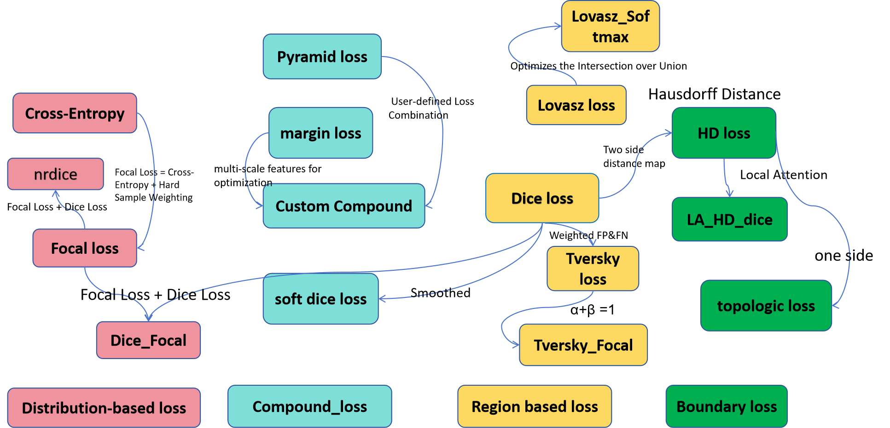

<h1 align="center">AweIRmodule红外模块汇总🤖

 </img></h1>

# 目录🚀
### 卷积模块-AwesomeConv💻
- **`说明：各类卷积模块`**  
  - 贡献者：By Chade Li。https://github.com/NOTpass0602/Convolution_block

### 注意力机制模块-AwesomeAttention🤗
- **`说明：各类注意力机制模块`**  
  - 贡献者：By Zhifei Luo。
### 损失函数模块-AwesomeLossFunction✨
- **`说明：各类损失函数`**  
  - 贡献者：By Yue Zhang。

 </img>

### 数据增强-AwesomeDataEnhance👻
- **`说明：常用数据增强`**  
  - 贡献者：By Chongwen Huang。
### 常用红外数据集汇总-AwesomeDatasets🎯
### 红外网络汇总-AwesomeNet😎

